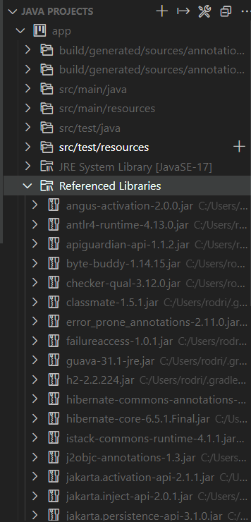
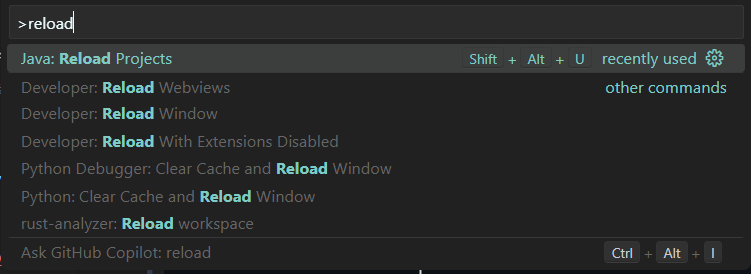

# ADA4: Realización de cambios Juego Maze

## What do you need?

- [Java 21](https://adoptium.net/temurin/releases/?os=windows&arch=x64&package=jdk).
    > Este projecto no es originalmente hecho por el equipo y no se sabe con qué versión de Java fue hecha, sin embargo para pruebas y desarrolllo posterior en este proyecto se está usando Java 21. Es posible que al ser un proyecto básico pueda funcionar con versiones inferiores como 20 o 17, en caso de usar otra versión especifique en el archivo [`app/build.gradle`](app/build.gradle) en el apartado `java.toolchain`

- En caso de usar Visual Studio Code como IDE:
    - [Extension Pack for Java](https://marketplace.visualstudio.com/items?itemName=vscjava.vscode-java-pack://)
    - [Gradle for Java](https://marketplace.visualstudio.com/items?itemName=vscjava.vscode-gradle)

## SetUp

Asegúrate de que estás usando la versión de Java correcta, verifícalo en [`app/build.gradle`](app/build.gradle)

### Visual Studio Code

> ℹ️ En este ejemplo se muestran las dependencias para un proyecto usando Hibernate, ahora mismo no se está usando dependencias más allá de las nativas de Java como Java Swing. Sin embargo para garantizar el correcto funcionamiento del entorno de desarrollo usando VS Code se recomienda verificar lo siguiente:

Verifica que detecte las depencias, esto demorará unos momentos debido a que Gradle al ser la primera vez abriendo el proyecto, estará descargando las dependencias especificadas en [`app/build.gradle`](app/build.gradle), las cuales son:

- [Hibernate](https://mvnrepository.com/artifact/org.hibernate/hibernate-core): `org.hibernate.orm:hibernate-core:6.5.1.Final`, de lo que se trata esta sesión práctica.
- [H2 Database](https://mvnrepository.com/artifact/com.h2database/h2): `com.h2database:h2:2.2.224`, usado para realizar las pruebas a una base de datos en memoria.

Es posible que Visual Studio Code no detecte las librerías, en ese caso necesitarás **recargar el proyecto** con la extensión de Java incluida en el pack de extensiones recomendado.
 

#### Run, Build, Debug...

Ahora puedes ejecutar *tasks* de Gradle, ya sea por terminal, ejecutando `./gradlew <task>` (ejem. `./gradlew run`) o por la extensión Gradle For Java que te permite debugear, ver todas las tareas, entre otras cosas.

