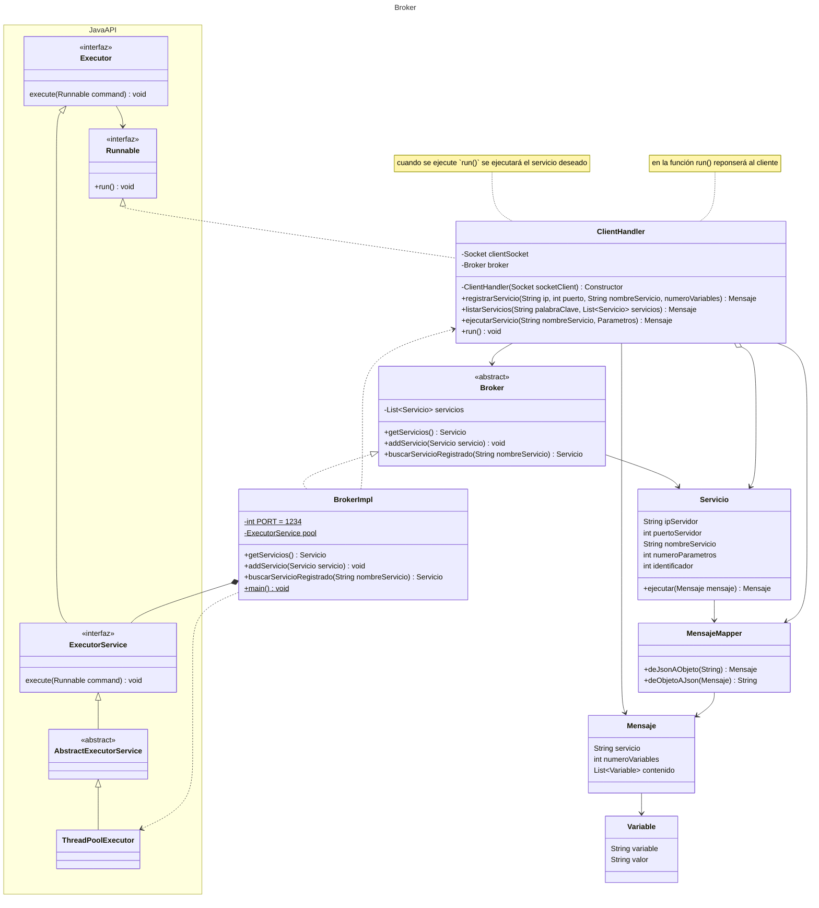

# Diagrama de clases del Broker

> El paquete `JavaAPI` entiéndase como `java.*`, clases de la api estándar de Java.

```mermaid
---
title: Broker
---

classDiagram

namespace JavaAPI{
    class Executor
    class ExecutorService
    class Runnable
    class AbstractExecutorService
    class ThreadPoolExecutor
}


Executor <|-- ExecutorService
class ExecutorService{
    <<interfaz>>
    execute(Runnable command) void
}

Executor --> Runnable
class Executor{
    <<interfaz>>
    execute(Runnable command) void
}

class Runnable{
    <<interfaz>>
    +run() void
}

AbstractExecutorService <|-- ThreadPoolExecutor
class ThreadPoolExecutor

ExecutorService <|-- AbstractExecutorService
class AbstractExecutorService{
    <<abstract>>
}

BrokerImpl *-- ExecutorService
BrokerImpl ..> ClientHandler
BrokerImpl ..> ThreadPoolExecutor
Broker <|.. BrokerImpl
Broker --> Servicio
class BrokerImpl{
    -int PORT = 1234 $
    -ExecutorService pool $
    +getServicios() Servicio
    +addServicio(Servicio servicio) void
    +buscarServicioRegistrado(String nombreServicio) Servicio
    +main() void$
}
class Broker{
    <<abstract>>
    -List~Servicio~ servicios 
    +getServicios() Servicio
    +addServicio(Servicio servicio) void
    +buscarServicioRegistrado(String nombreServicio) Servicio
}

Servicio --> MensajeMapper
class Servicio{
    String ipServidor
    int puertoServidor
    String nombreServicio
    int numeroParametros
    int identificador
    +ejecutar(Mensaje mensaje) Mensaje
}

Runnable <|.. ClientHandler
ClientHandler o--> Servicio
ClientHandler --> MensajeMapper
ClientHandler --> Mensaje
ClientHandler --> Broker
note for ClientHandler "cuando se ejecute `run()` se ejecutará el servicio deseado"
note for ClientHandler "en la función run() reponserá al cliente"
class ClientHandler{
    -Socket clientSocket
    -Broker broker
    -ClientHandler(Socket socketClient) Constructor
    +registrarServicio(String ip, int puerto, String nombreServicio, numeroVariables) Mensaje
    +listarServicios(String palabraClave, List~Servicio~ servicios) Mensaje
    +ejecutarServicio(String nombreServicio, Parametros) Mensaje
    +run() void
}


Mensaje --> Variable
class Mensaje{
    String servicio
    int numeroVariables
    List~Variable~ contenido
}

class Variable{
    String variable
    String valor
}

MensajeMapper --> Mensaje
class MensajeMapper{
    +deJsonAObjeto(String) Mensaje
    +deObjetoAJson(Mensaje) String
}
```