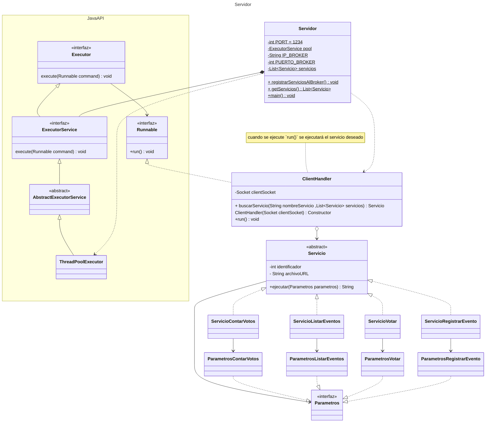

# Diagrama de clases del Servidor

> El paquete `JavaAPI` entiéndase como `java.*`, clases de la api estándar de Java.

```mermaid
---  
title: Servidor

---

classDiagram

namespace JavaAPI{
    class Executor
    class ExecutorService
    class Runnable
    class AbstractExecutorService
    class ThreadPoolExecutor
}
Executor <|-- ExecutorService
class ExecutorService{
    <<interfaz>>
    execute(Runnable command) void
}
Executor --> Runnable
class Executor{
    <<interfaz>>
    execute(Runnable command) void
}
class Runnable{
    <<interfaz>>
    +run() void
}
AbstractExecutorService <|-- ThreadPoolExecutor
class ThreadPoolExecutor
ExecutorService <|-- AbstractExecutorService
class AbstractExecutorService{
    <<abstract>>
}
Servidor *-- ExecutorService
Servidor ..> ClientHandler
Servidor ..> ThreadPoolExecutor
class Servidor{
    -int PORT = 1234 $
    -ExecutorService pool $

    -String IP_BROKER $
    -int PUERTO_BROKER $
    -List~Servicio~ servicios $
    + registrarServiciosAlBroker() void $
    + getServicios() List~Servicio~$
    +main() void$
}
Runnable <|.. ClientHandler
ClientHandler o--> Servicio
note for ClientHandler "cuando se ejecute `run()` se ejecutará el servicio deseado"
class ClientHandler{
    -Socket clientSocket
    + buscarServicio(String nombreServicio ,List~Servicio~ servicios) Servicio
    ClientHandler(Socket clientSocket) Constructor
    +run() void
}
Servicio --> Parametros
class Servicio{
    <<abstract>>
    -int identificador
    - String archivoURL
    +ejecutar(Parametros parametros) String
}
class Parametros{
    <<interfaz>>
}
class ServicioContarVotos
class ServicioListarEventos
class ServicioVotar
class ServicioRegistrarEvento
Servicio <|.. ServicioContarVotos
Servicio <|.. ServicioListarEventos
Servicio <|.. ServicioVotar
Servicio <|.. ServicioRegistrarEvento
ServicioContarVotos --> ParametrosContarVotos
ServicioListarEventos --> ParametrosListarEventos
ServicioVotar --> ParametrosVotar
ServicioRegistrarEvento --> ParametrosRegistrarEvento
 ParametrosContarVotos ..|> Parametros
 ParametrosListarEventos ..|> Parametros
 ParametrosVotar ..|> Parametros
 ParametrosRegistrarEvento ..|> Parametros


```